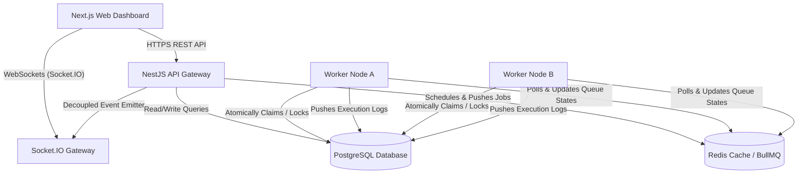
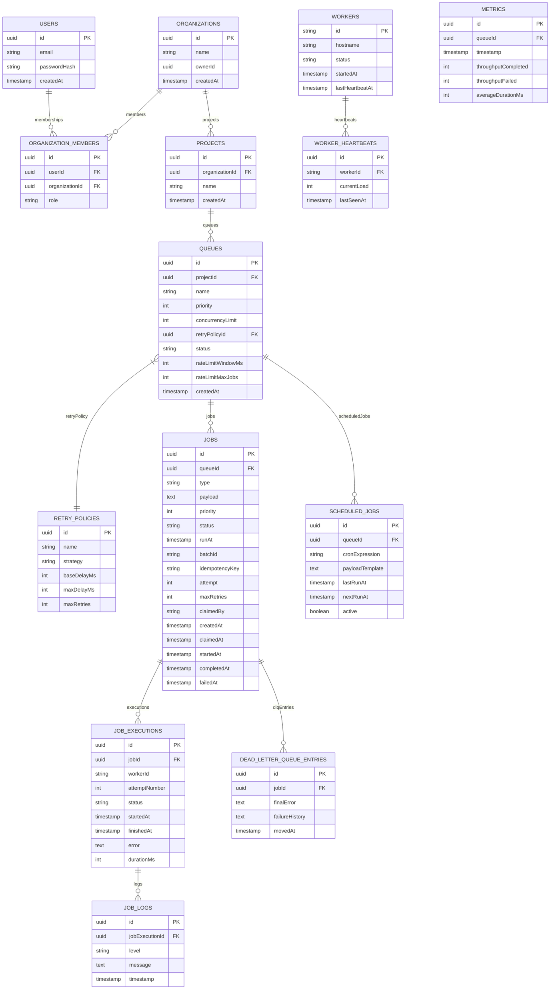

# Design Decision Document - Distributed Job Scheduler Platform

This document describes the architectural decisions, database models, ER diagrams, and system designs applied in building the Distributed Job Scheduler Platform.

## 1. System Architecture Diagram

Below is the high-level architecture diagram detailing the relationships between Next.js control panel clients, NestJS API gateways, PostgreSQL, Redis, and the worker cluster.



---

## 2. Entity-Relationship (ER) Diagram

The PostgreSQL schema is highly normalized to model organizational contexts, projects, queues, retries, and comprehensive worker heartbeat history.



---

## 3. Scalability and Reliability Decisions

### 3.1 double-Execution Avoidance (Atomic Claiming)
To prevent two distributed workers from picking up and executing the same background job concurrently under peak load conditions, we use a database-level row lock. When a worker polls for a job, it executes the query within a database transaction using **Pessimistic Write Locking** (`FOR UPDATE` statement):
```sql
SELECT * FROM jobs WHERE id = :jobId AND status IN ('QUEUED', 'RETRYING') FOR UPDATE;
```
If the row is returned, the worker atomically changes its status to `RUNNING` and sets `claimedBy = workerId`. This row-locking mechanism ensures strict mutual exclusion at the database layer.

### 3.2 Dead Worker Failover Detection
If a worker process crashes abruptly (e.g. out of memory, network interface card failure, hardware reboot), any jobs it had claimed would remain stuck in the `RUNNING` state indefinitely. 
To resolve this, workers periodically write to a `worker_heartbeats` table (every 5 seconds) and update their `lastHeartbeatAt` timestamp. The API gateway runs a periodic background task (cron job every 10 seconds) that scans for workers whose `lastHeartbeatAt` is older than 30 seconds.
When a dead worker is detected:
1. Its status is marked `INACTIVE`.
2. All jobs claimed by this worker that are in `RUNNING` state are fetched.
3. For each job, we check if it has remaining retries. If yes, the status is reverted to `QUEUED`, its attempt count is incremented, and it is pushed back to the BullMQ processing queue. If no retries remain, it is moved to the **Dead Letter Queue (DLQ)**.

### 3.3 Dynamic Queue Synchronization
Instead of hardcoding queues in worker configuration files, workers periodically query the database for active queues (`status = 'ACTIVE'`). For any new queue created via the dashboard, the worker dynamically instantiates a new BullMQ `Worker` instance with the designated `concurrencyLimit`. Similarly, if a queue is paused, the worker closes that BullMQ worker instance, stopping the ingestion pipeline instantly.
